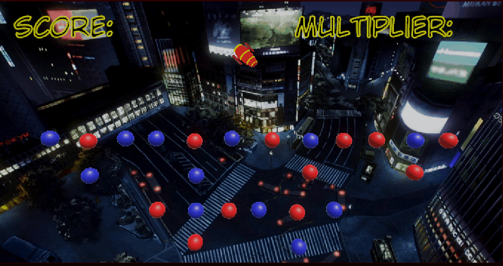

# mijnpegglegame
mijn gif voor 2.1 2.2 en 2.3

> hier zie je de bal die afgeschoten wordt en de lijn
>ook heb ik een punten systeem met een multiplier 
>en de balletjes die na drie hit gedestroyed worden

De gif voor de rest van wat ik had gemaakt

>ik had de particle effects en de score af kunnen krijgen
>ook heb ik een background image toegevoegd en een werkent combo systeem.